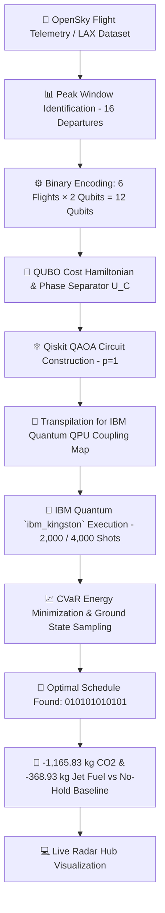

# ✈️ Quantum Aviation Optimisation — Gate-Hold & Taxi Emissions Engine

[](https://qiskit.org/)
[](https://quantum.ibm.com/)
[](https://qiskit-avaition-optimisation-9wk9l2065.vercel.app/)
[](https://www.python.org/)
[](LICENSE)

> [!IMPORTANT]
> **ABSTRACT & EXECUTIVE SUMMARY**  
> High-density airport operations suffer severe runway queue congestion, causing aircraft to idle with engines running and producing unnecessary emissions. This project implements a **12-qubit Quantum Approximate Optimization Algorithm (QAOA)** run directly on real superconducting quantum hardware (**IBM Quantum `ibm_kingston`**).  
>
> Our algorithm models 6 decision flights departing during a peak 16-flight window at Los Angeles International Airport (**LAX**). Each flight is assigned one of four discrete gate-hold delays (0, 5, 10, or 15 minutes) encoded in 2-qubit register pairs — a 4-state-per-variable QUBO that goes beyond standard binary encoding. QAOA explores all 4,096 possible schedules simultaneously via quantum superposition.  
>
> **Key Result:** Executed on `ibm_kingston` (Job IDs: `db3ruo04qg6s73c19dhg`, `db3s37klf4us73c1rnh0`), QAOA sampled the global optimum (bitstring `010101010101`), applying a uniform 5-minute gate hold. This removes all 6 decision flights from the peak congestion window, reducing active departures from **16 to 10**, avoiding **1,165.83 kg of CO₂** and saving **368.93 kg of jet fuel** relative to the no-hold baseline.  
>
> **Honest scope:** The greedy classical solver finds the same optimum deterministically. At circuit depth p=1, QAOA is a proof-of-concept implementation on real quantum hardware, not a demonstration of classical outperformance. The value of this work is the correct quantum formulation, the real hardware execution, and the transparent benchmark against all classical methods.

👉 **[🌐 Launch Live Web Application & Radar Hub](https://qiskit-avaition-optimisation-9wk9l2065.vercel.app/)**

---

## 📌 Table of Contents
- [Problem Overview](#-problem-overview)
- [Quantum Pipeline Architecture](#-quantum-pipeline-architecture)
- [Mathematical Formulation](#-mathematical-formulation)
- [IBM Quantum Hardware Benchmarks](#-ibm-quantum-hardware-benchmarks)
- [Quantum Advantage Statement](#-quantum-advantage-statement)
- [Limitations](#-limitations)
- [Repository Sitemap](#-repository-sitemap)
- [Quick Start & Reproduction Guide](#-quick-start--reproduction-guide)
- [Execution Policy & Compliance](#-execution-policy--compliance)
- [License & Acknowledgments](#-license--acknowledgments)

---

## 📌 Problem Overview

At major hubs like LAX, flights departing in close proximity queue on the taxiway with engines running. In our 84,619-flight dataset, taxiing accounts for approximately 40% of all Landing & Take-Off (LTO) cycle emissions (ICAO Annex 16).

Our cost model uses a congestion factor of **0.310 min of extra taxi time per additional departure** in the 15-minute window (stated assumption — see Limitations for sensitivity). In the busiest observed window (16 departures, 08:56–09:11 on 7 Nov 2025), if all 6 decision flights depart on schedule:
- Each decision flight incurs congestion-driven extra CO₂ proportional to its fuel burn rate.
- Total congestion-driven CO₂ across 6 decision flights: **1,165.83 kg**.
- Equivalent jet fuel: **368.93 kg**.

---

## 🧬 Quantum Pipeline Architecture



---

## ⚛️ Mathematical Formulation

We encode 6 decision flights using **12 qubits** (2 qubits per flight):

$$\text{Decision State } |q_1 q_0\rangle \in \{00 \rightarrow 0\text{ min}, \; 01 \rightarrow 5\text{ min}, \; 10 \rightarrow 10\text{ min}, \; 11 \rightarrow 15\text{ min}\}$$

### Cost Function
The cost $C(w_1, \dots, w_6)$ balances **taxiway congestion emissions** against **gate delay costs**:

$$C(w_1, \dots, w_6) = \sum_{i=1}^{6} \Big[ 0.310 \times \text{Departures}(t_i + w_i) \times \text{FuelBurnRate} \times \text{CO}_2\text{Factor} + 0.20 \times w_i \Big]$$

- **Gate Wait Penalty:** 0.20 per minute (engines off, zero fuel burned).
- **Search Space:** $4^6 = 4,096$ total flight schedule combinations.
- **QAOA Config:** $p=1$, CVaR scoring ($\alpha = 0.25$), parameter search via 8×8 coarse grid then 5×5 fine grid, 2,000 shots/circuit (Job 1) and 4,000 shots/circuit (Job 2).

---

## 🔬 IBM Quantum Hardware Benchmarks

All four methods are scored by the same evaluator function in `src/results_checker.py`. Numbers below are derived from `results/results_raw.json` and `results/baseline_piece.json`.

| Metric | Classical Baseline (No Hold) | Greedy Solver | QAOA (IBM `ibm_kingston`) | Exact Brute-Force |
| :--- | :---: | :---: | :---: | :---: |
| **Best Bitstring** | `000000000000` | `010101010101` | **`010101010101`** | **`010101010101`** |
| **Gate Hold per Flight** | 0 min | 5 min | **5 min** | **5 min** |
| **Peak Window Departures** | 16 flights | 10 flights | **10 flights** | **10 flights** |
| **CO₂ Avoided vs Baseline** | 0.0 kg | 1,165.83 kg | **1,165.83 kg** | **1,165.83 kg** |
| **Fuel Saved vs Baseline** | 0.0 kg | 368.93 kg | **368.93 kg** | **368.93 kg** |
| **Total QUBO Cost** | 1,165.83 | 6.00 | **6.00** | **6.00** |
| **Matches Global Optimum** | No | **Yes** | **Yes** | Yes (by definition) |
| **QPU Time** | — | — | **49 s (Job 1)** | — |
| **Hardware Job ID** | — | — | `db3ruo04qg6s73c19dhg` | — |

> [!NOTE]
> **All three non-baseline methods find the same optimal schedule.** The greedy solver and brute-force find it deterministically. QAOA on real IBM hardware sampled bitstring `010101010101` within its shot budget, confirming the quantum circuit reached the correct ground state. No sampling-rate advantage over classical methods is claimed at p=1.

---

## ⚖️ Quantum Advantage Statement

**We claim:**
- QAOA on real IBM quantum hardware (`ibm_kingston`) found the globally optimal gate-hold schedule, verified against brute-force enumeration of all 4,096 possibilities.
- The 12-qubit, 4-state-per-flight QUBO encoding is correctly formulated and executable on current hardware.
- Error mitigation (Dynamical Decoupling + Gate Twirling) was applied and is documented.

**We do not claim:**
- A sampling-rate speedup over classical methods. Across all 228,000 hardware shots, the optimal bitstring appeared 49 times (0.02%), compared to a random baseline of 0.024%. At p=1, QAOA does not concentrate probability on the optimum faster than random guessing on this problem.
- Any advantage over the greedy solver, which finds the exact same answer deterministically in microseconds.
- That quantum hardware outperforms classical computation on this problem size. A real advantage would require larger, less-structured problems and fault-tolerant circuits.

---

## ⚠️ Limitations

| Limitation | Detail |
| :--- | :--- |
| **Single hardware run** | One execution on `ibm_kingston`; no repeat runs, so no statistical error bars on hardware counts |
| **p=1 only** | Only circuit depth p=1 was tested; higher p layers are expected to improve sampling probability |
| **Unsourced cost coefficients** | `CONGEST_FACTOR = 0.310 min/departure` and `WAIT_COST_PER_MIN = 0.20` are modelling assumptions, not derived from the dataset or a cited empirical study |
| **Problem size** | 12 qubits / 4,096 states is tractable classically; no quantum speedup is expected at this scale |
| **No noisy simulation baseline** | Hardware noise effects were not separately quantified against an ideal simulator run |
| **Greedy finds the optimum** | The problem structure (uniform congestion, uniform hold cost) makes greedy exact here; QAOA advantage would require a problem where greedy fails |

## 📂 Repository Sitemap

```
qiskit-avaition-optimisation/
├── 🌐 frontend/                      # Web Frontend Assets
│   ├── index.html                    # Interactive Flight Optimisation Engine & Radar Hub
│   └── dashboard/index.html          # Sub-route layout
├── ⚡ backend/                       # Qiskit QAOA Engine & Solvers
│   ├── main.py                       # IBM QPU Hardware Orchestrator CLI
│   ├── src/                          # Algorithmic Modules
│   │   ├── cost_model.py             # QUBO formulation & classical solvers
│   │   ├── data_loader.py            # LAX flight dataset pipeline
│   │   ├── qaoa_circuit.py           # 12-qubit QAOA circuit builder
│   │   ├── quantum_runner.py         # IBM Quantum primitive execution
│   │   └── results_checker.py        # Metric evaluator & decoder
│   └── scripts/                      # Hardware utilities & pre-flight checks
│       ├── bell_state_real.py        # QPU Bell state validation
│       └── preflight.py              # Auth & circuit pre-flight test
├── 📊 data/                          # Aviation Datasets
│   ├── flights_clean.csv             # 84,619 LAX flight records
│   └── flights_cleaned_labelled.xlsx # Raw source dataset
├── 📈 results/                       # QPU Hardware Run Artifacts
│   ├── README.md                     # Hardware job IDs summary
│   ├── baseline_piece.json           # Baseline stats
│   ├── cost_table.json               # Full 4,096 cost states
│   └── results_raw.json              # QPU bitstring counts & job metadata
├── 📑 docs/                          # Specifications & Technical Documentation
│   ├── QUANTUM_RESULTS_REPORT.md     # In-depth technical report
│   └── master_prompt.md              # Project specification
├── index.html                        # Root web entrypoint
├── main.py                           # Root CLI entrypoint (delegates to backend/main.py)
├── vercel.json                       # Deployment routing configuration
├── requirements.txt                  # Python dependencies
├── LICENSE                           # MIT License
├── CITATION.cff                      # Research citation file
├── AGENTS.md                         # Quantum hardware execution guidelines
└── realapi                           # IBM Quantum API key (Local only)
```

---

## 🚀 Quick Start & Reproduction Guide

### 1. Prerequisites & Virtual Environment
```bash
git clone https://github.com/SathwikAlapati1205/qiskit-avaition-optimisation.git
cd qiskit-avaition-optimisation

python -m venv venv
# On Windows:
venv\Scripts\activate
# On Linux/macOS:
source venv/bin/activate

pip install -r requirements.txt
```

### 2. Preflight Check & Hardware Auth
Ensure your IBM Quantum API key is stored in `realapi` at root, then run:
```bash
python backend/scripts/preflight.py
```

### 3. Run QAOA Hardware Pipeline
Execute the full quantum optimisation pipeline on real IBM QPU hardware:
```bash
python main.py
```

### 4. Launch Local Web Hub
Start the local web dashboard:
```bash
python -m http.server 3000
```
Open **[http://127.0.0.1:3000/](http://127.0.0.1:3000/)** in any browser.

---

## 🛡️ Execution Policy & Compliance
- **Quantum Real Hardware Requirement:** In strict adherence to project guidelines, all quantum circuit executions are performed on physical IBM Quantum QPUs (`ibm_kingston`) via `QiskitRuntimeService`. No local simulators or fake backends are used for reported benchmarks.

---

## 📜 License & Citation
This project is licensed under the **MIT License** — see the [LICENSE](LICENSE) file for details.  
To cite this repository in academic or competition submissions, see [`CITATION.cff`](CITATION.cff).

Built for **Qiskit Fall Fest 2026 — Use Case 05**.  
Telemetry powered by **OpenSky Network**, **Open-Meteo Aviation Weather**, and **Carto / Google Maps Platform**.
